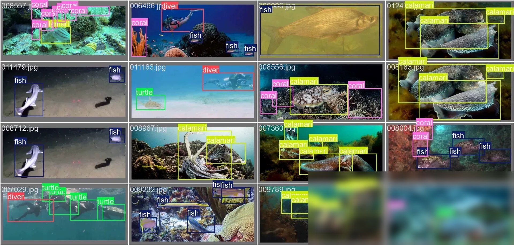
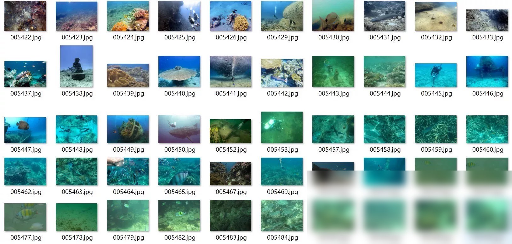
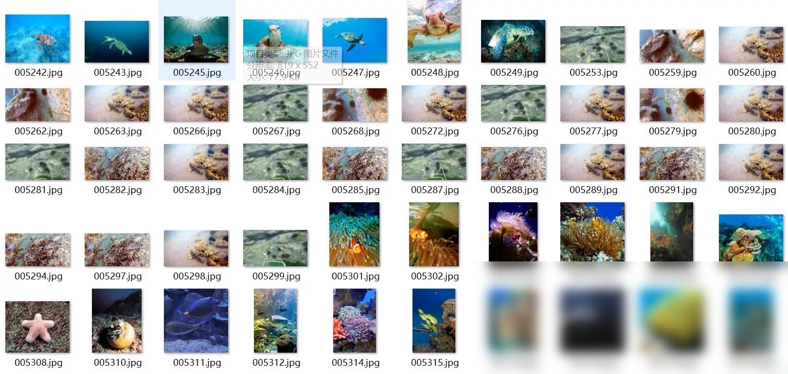
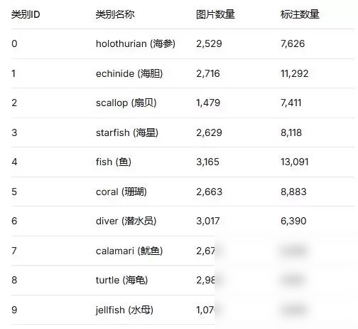
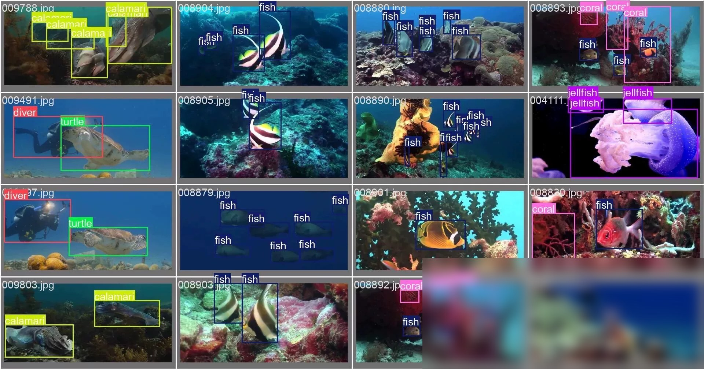

# Underwater target detection dataset 14000 images YOLO format including sea cucumbers.

# Body

Underwater Object Detection Dataset, 14000 images in YOLO format, including categories such as sea cucumber, sea urchin, scallop, starfish, fish, coral, diver, squid, turtle, and jellyfish. The images are clear and labeled comprehensively, suitable for underwater object detection, algorithm training, research purposes.
upon purchase， .

Category ID Category Name Image Count Annotation Count
0 Holothurian (Sea Cucumber) 2,529 7,626
The provided data appears to be a list of numbers, but it is not clear what the context or purpose of this list is. If you need help with any specific mathematical problem related to the numbers in the list, please provide more details or clarify your question.
2. Scallop (Sea Urchin) 1,479 7,411
3. Starfish (Seastar) 2,629 8,118
To solve the problem, we need to determine the number of fish produced by Party B based on the given data.

From the table, it is stated that
- The first entry in the table shows the total number of fish produced by both parties (Party A and Party B) combined.
- The second entry shows the number of fish produced by Party A alone.
- The third entry shows the number of fish produced by Party B alone.

Given that the total number of fish produced by both parties combined is 3,165, and the number of fish produced by Party A alone is 13,091, we can calculate the number of fish produced by Party B alone as follows

$$ \text{Number of fish produced by Party B alone} = \text{Total fish produced by both parties} - \text{Fish produced by Party A alone} $$

Substituting the values from the table

$$ \text{Number of fish produced by Party B alone} = 3,165 - 13,091 $$

Performing the subtraction

$$ \text{Number of fish produced by Party B alone} = -9,926 $$

Since the result is negative, this indicates that Party B did not produce any fish at all. Therefore, the number of fish produced by Party B alone is $0$.

The final answer is

$$ \boxed{0} $$
The provided data seems to be a table with two columns: "Coral" and "Count". The count column is labeled as "8,883" but the value for coral is missing. To provide a complete answer, I'll assume that the count for coral is 2,663.

If we want to find the total number of corals based on the given count, we can use the formula

Total corals = Count for coral + Count for other species

Since there are no other species listed in the table, we can simplify this to

Total corals = Count for coral

Substituting the given count for coral

Total corals = 2,663

So, the total number of corals is 2,663.
6 diver (Diver) 3,017 6,390
7. Calamari (Squid) 2,672 5,328

8 Turtle (Sea Turtle) 2,982 4,120
9 Jellyfish (Jellyfish) 1,070 2,645

# Images

# Payment

Here is a pay link on Stripe ( https://buy.stripe.com/3cs8yP7sY87d0vu9AB ). Please contact me lonlonago@foxmail.com after funding $89, and I will send you a complete data files , thank you

Computer vision/deep learning algorithm services primarily focus on areas such as object detection, image segmentation, multimodal analysis, defect detection, face recognition, OCR, medical image analysis, autonomous driving perception, video understanding, behavior recognition, point cloud processing, image enhancement and restoration, image retrieval, and motion prediction.
Communication can be conducted based on specific tasks: model replication, algorithm optimization, performance improvement, model modification, code interpretation/code analysis, data processing, environment configuration, parameter tuning, experimental design, and result analysis, etc.
Core direction overview:
1. Object detection/tracking
Object detection, salient object detection, keypoint detection, lane line detection, point cloud object detection, point cloud segmentation, object tracking, motion detection, motion prediction.
2. Image segmentation/reconstruction
Image segmentation, semantic segmentation, medical image segmentation, geographic information segmentation, remote sensing data segmentation, 3D reconstruction, super-resolution reconstruction, point matching.
3. Face recognition/OCR/Industrial inspection
Face recognition, face detection, mask detection, license plate recognition, text recognition, OCR, defect detection, industrial inspection, anomaly detection.
4. Video understanding/behavior recognition
Video understanding, behavior recognition, pose estimation, gesture recognition, fight recognition, depth estimation, and autonomous driving perception.
5. Image enhancement/restoration
Image dehazing, image deraining, denoising, defogging, image restoration, and image compression.
6. Multimodal/large model related
The directions of multimodal, large model fine-tuning, algorithm analysis, and joint image-text representation are communicable.
Technology stack:
Inference frameworks: TensorRT, ONNX, OpenVINO
Common models/directions: YOLO, GAN, VIT, SLAM, diffusion models, etc. Discussions can be held based on project requirements.
Application fields:
For applications such as street view, medicine, remote sensing, daily scenes, industrial inspection, autonomous driving, and biomedical imaging, we can first discuss the specific requirements.
Individual work, suitable for developers with experience in computer vision, deep learning, algorithm replication, model optimization, code development, and project requirements.
The price is determined based on the difficulty and workload of the project.
Individual order receiving, quality guaranteed, after-sales service guaranteed. Welcome to directly send a private message to specify the specific task. We can communicate according to the specific task: model replication, algorithm optimization, performance improvement, model modification, code interpretation/code analysis, data processing, environment configuration, parameter tuning, experimental design and result analysis, etc.
Contact information: lonlonago@foxmail.com

